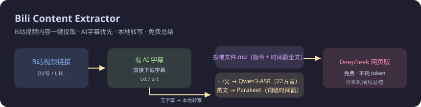

# 📺 Bili Content Extractor（B站视频内容一键提取）

**[English](README_EN.md) · 中文**

把任意 B 站视频变成**可读文本 + 可投喂的总结材料**，全程本地、免费、不消耗 token。



```
B站视频链接
   │
   ├─ 有 AI 字幕 ──→ 直接下载字幕（txt / srt）
   │
   └─ 无 AI 字幕 ──→ 自动检测语言，本地转写
                      ├─ 中文/方言 → Qwen3-ASR-1.7B（22种方言，快且准）
                      └─ 英文      → Parakeet-TDT-0.6B（词级时间戳，RTF 0.16）
                            │
                            ▼
              生成「投喂文件.md」（视频信息 + 指令 + 带时间戳全文）
                            │
                            ▼
        拖进 DeepSeek 网页版 → 免费得到详细时间线总结（不花 token）
```

## ✨ 特性

- **字幕优先**：有 AI 字幕的视频直接下载，零成本零延迟
- **中文方言识别**：Qwen3-ASR 支持 22 种中文方言，口语/快语速/吐字不清场景显著优于 Whisper
- **英文词级时间戳**：Parakeet 每个词带时间戳+置信度，噪声鲁棒性超 Whisper
- **免费总结**：产出带指令的投喂文件，配合 DeepSeek **网页版**免费总结，不消耗 API token
- **全程本地**：音频转写完全本地运行，不上传
- **硬盘友好**：双模型约 4.5GB，可放任意盘（默认 `D:\BiliModels`，环境变量可改）

## 📦 环境要求

- Windows / Linux / macOS（parakeet.cpp 需对应平台二进制）
- Python 3.10+
- [ffmpeg](https://ffmpeg.org/)（转码音频）

## 🚀 安装

```bash
git clone https://github.com/rngfbbbffhjgggd-commits/bili-content-extractor.git
cd bili-content-extractor
pip install -r requirements.txt
```

## 🤖 模型下载（约 4.5GB，放 `D:\BiliModels` 或自定义目录）

### 中文：Qwen3-ASR-1.7B（int4 ONNX，3.9GB）

从 [andrewleech/qwen3-asr-1.7b-onnx](https://huggingface.co/andrewleech/qwen3-asr-1.7b-onnx) 下载 `qwen3-asr-1.7b-int4.tar.gz`，解压到：
```
D:\BiliModels\qwen3-asr-1.7b\qwen3-asr-1.7b-int4\
```

### 英文：Parakeet-TDT-0.6B（675MB）

1. 下载 [parakeet.cpp](https://github.com/mudler/parakeet.cpp/releases) 的 Windows CPU 版 `parakeet-v0.5.0-bin-win-cpu-x64.zip`，解压到：
```
D:\BiliModels\parakeet\parakeet-v0.5.0-bin-win-cpu-x64\
```
2. 从 [mudler/parakeet-cpp-gguf](https://huggingface.co/mudler/parakeet-cpp-gguf) 下载 `tdt-0.6b-v3-q4_k.gguf` 到：
```
D:\BiliModels\parakeet\
```

> 💡 网络不稳时可用仓库自带的 `parallel_download.py` 分片并行下载（快 300 倍）：
> ```bash
> python parallel_download.py <url> <保存路径> 16 2
> ```

## 🔑 配置 B 站 Cookie（一次性）

B 站的 AI 字幕列表**需要登录态**才能获取：

1. 浏览器登录 bilibili.com，打开任意视频页
2. F12 → Network → 刷新 → 点任意 `api.bilibili.com` 请求
3. 复制 Request Headers 里整段 `Cookie:` 的值
4. 保存为 `cookie.txt`（放在脚本目录，一行）

> 🔒 cookie 仅保存在本地、只用于调用 B 站接口，不会上传；约一个月过期，过期后重新复制即可。

## 🎯 使用

**Windows 一键版**：双击 `B站一键提取.bat` → 粘贴链接 → 回车。

**命令行**：
```bash
python bili_quick.py "https://www.bilibili.com/video/BVxxxx"   # 自动检测语言
python bili_quick.py <链接> --lang=zh                          # 强制中文
python bili_quick.py <链接> --lang=en                          # 强制英文
python bili_quick.py <链接> --api                              # 可选：用 DeepSeek API 自动总结（消耗 token）
```

**产物**（`BilibiliContent/<BV号>/`）：
- 有字幕：`P1_ai-zh.txt` / `.srt`
- 无字幕：`transcript.txt` + `投喂DeepSeek网页版.md`
- 投喂文件内含完整指令，拖进 [chat.deepseek.com](https://chat.deepseek.com) 回车即可得到详细时间线总结

## 🧩 环境变量

| 变量 | 默认值 | 说明 |
|---|---|---|
| `BILI_MODELS_ROOT` | `D:\BiliModels` | 模型根目录 |
| `QWEN_ASR_DIR` | `<MODELS_ROOT>\qwen3-asr-1.7b\...` | Qwen3-ASR 模型目录 |
| `PARAKET_EXE` | `<MODELS_ROOT>\parakeet\...\parakeet-cli.exe` | parakeet 可执行文件 |
| `PARAKET_GGUF` | `<MODELS_ROOT>\parakeet\tdt-0.6b-v3-q4_k.gguf` | parakeet 模型 |
| `BILI_COOKIE_FILE` | `./cookie.txt` | cookie 文件路径 |
| `BILI_DEEPSEEK_KEY_FILE` | `./deepseek_key.txt` | DeepSeek key 文件路径（仅 `--api` 用） |

## ⚖️ 免责声明

- 本项目仅用于个人学习与研究，字幕/音频内容版权归原作者与 B 站所有
- 请遵守 [Bilibili 服务条款](https://www.bilibili.com/blackboard/activity-9pg6xIqxDZ.html) 及视频版权规定
- 请勿用于商业用途或大规模抓取
- 本项目与哔哩哔哩官方无任何关联

## 📄 License

MIT
